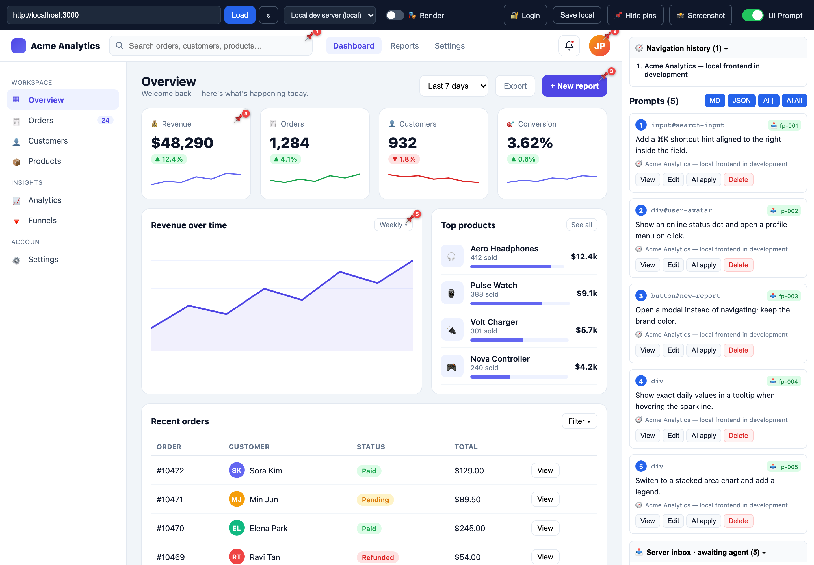
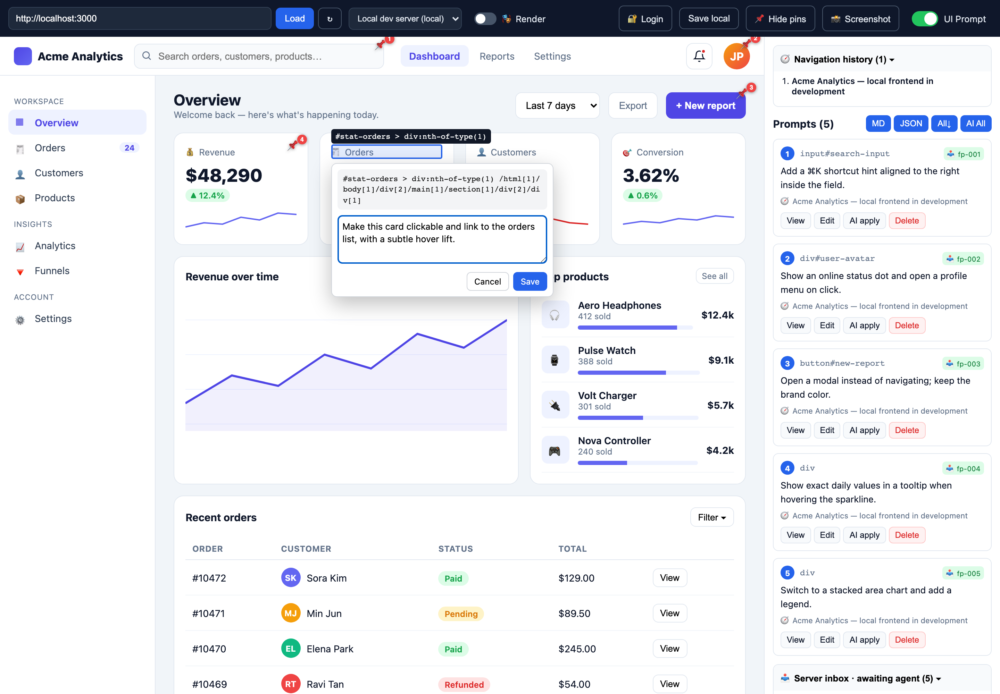

# VisualPrompt

A tool that lets you **pin edit prompts onto a web UI** to collect "fixpoints",
then **writes them as structured documents into the server's inbox directory** so a server-side agent (Claude Code, etc.)
can edit the actual source code. SPA, login, and bot-blocked sites are handled via **headless browser rendering**.

> 🌐 **Intro / landing page:** https://uxaipark.github.io/visualprompt/ &nbsp;·&nbsp; 📖 **Docs:** [`docs/`](./docs)

## Screenshots

**1. Pin edit prompts across a complex UI** — toggle *UI Prompt* mode and drop a pin (📌) on any element. Each pin captures the element's `selector`/`xpath` + your prompt, lists it in the side panel, and queues it in the server inbox for the agent.



**2. Write an edit prompt** — click an element; a popover shows its `selector` / `xpath`, and you type the change you want.



## Quick start
```bash
bash install.sh      # dependencies + Chromium + .env
npm run dev          # server :3001 + client :5173  → http://localhost:5173
# or single-server production serving
npm run preview      # build then http://localhost:3001
```

## Three usage scenarios
1. **Edit a local dev server** — register your dev frontend URL and `repoRoot` under `targets` in `fixpin.config.json`.
   Pinning writes a fixpoint to `fixpoints/pending/fp-NNN.{json,md}`, and the agent edits the repo source
   following the `fixpoints/AGENT.md` instructions.
2. **Download fixpoints from a public site** — load a URL, drop pins, and use the side panel `Download all↓` to
   download **screenshot (PNG) + MD + JSON**.
3. **Crawl → edit preview** — use `Save locally` (snapshot) to preserve the page on the server, then
   use `Apply AI` (requires ANTHROPIC_API_KEY) to edit the crawled source and preview the changes.

## Collection paths
- **Proxy mode** (default): the server does fetch → rewrite → inspector injection → re-serve. Fast for local dev servers and simple sites.
- **Render mode** (🎭 toggle): renders the complete DOM with headless Chromium. Handles naver/login/SPA/Figma.

## Directories
```
server/   index.js (routing) proxy.js (rewrite) render.js (Playwright) snapshot.js inbox.js
          public/{shim,inspector}.js
client/   React app (Toolbar · SidePanel · App + lib/exporters)
fixpoints/ pending|applied|AGENT.md   ← agent inbox
snapshots/ crawl snapshots
```

## API
- `GET  /proxy?url=&render=` — page wrapping (+render)
- `GET  /api/config` — targets and renderer availability
- `GET/POST/DELETE /api/snapshot` — snapshot (render option)
- `GET  /api/screenshot?url=&full=` — full-page PNG
- `GET/POST /api/fixpoints` · `POST /api/fixpoints/:id/apply` · `DELETE /api/fixpoints/:id`
- `POST /api/edit` — AI edit of snapshot outerHTML (preview)
