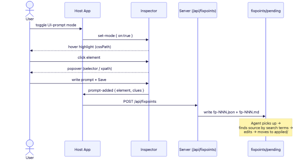

# 04. Fixpoint Inbox — Agent Handoff

The final product of collection. One pin = one `fixpoints/pending/fp-NNN.{json,md}` file.
An agent (e.g., Claude Code) running on the server reads pending, edits the real source, and moves it to applied.



## 1. Directory structure

```
fixpoints/
├─ pending/   fp-001.json + fp-001.md   ← unprocessed fixpoints
├─ applied/   (processed ones, moved here)
└─ AGENT.md   agent work instructions (auto-generated)
```

The fp files under `pending/`·`applied/` are `.gitignore`d (real data). Only the structure, `AGENT.md`,
and `.gitkeep` are committed.

## 2. Fixpoint JSON schema (`inbox.js: saveFixpoint`)

```jsonc
{
  "id": "fp-001",
  "createdAt": "2026-06-20T...Z",
  "status": "pending",
  "prompt": "Make the buy button bigger and green",   // user's edit instruction
  "page": "http://localhost:3000/",
  "target": { "mode": "local|proxy|extension", "url": "...", "repoRoot": "./demo-app" },
  "view": { "title": "...", "heading": "...", "url": "..." },
  "element": {
    "tag": "button", "id": "buy",
    "selector": "#buy",
    "xpath": "/html/body/button[1]",
    "rect": { "x": 10, "y": 20, "w": 80, "h": 30 },
    "text": "Buy", "classes": ["btn","primary"], "attributes": {...}
  },
  "clues": {
    "framework": "react",
    "testids": ["buy-btn"], "components": ["BuyButton"],
    "ids": [...], "labels": [...], "classes": [...],
    "bundles": ["..."], "api": [{ "method":"POST", "path":"/api/order" }]
  },
  "sourceHints": {
    "frontend": ["data-testid=\"buy-btn\"", "component:BuyButton", ".btn"],
    "backend":  ["POST /api/order"]
  },
  "fileHints": ["**/BuyButton*.{jsx,tsx,vue,svelte}", "grep: data-testid=\"buy-btn\""],
  "snapshot": null
}
```

### How clues are collected (`inspector.js: sourceClues`)
Walks up to 6 ancestors from the target:
- meaningful `data-*` (`testid`/`qa`/`component`/`name`, etc.)
- `id`, `name`, `aria-label`, `role`
- meaningful classes (excludes hashes, numbers, `__vp` prefix)
- framework detection (next/nuxt/vue/angular/svelte/react)
- bundle scripts, recent API calls (`__VP_NET__` / extension uses PerformanceObserver)

### Search-term derivation (`exporters.js` / `inbox.js`, same rules)
- Frontend: `data-testid="..."`, `component:...`, `#id`, label, `.class`
- Backend: `METHOD /path`

## 3. Markdown (`fp-NNN.md`) — the doc the agent reads

```markdown
# Fixpoint fp-001
> status: pending · created: ...

## Edit instruction (user prompt)
Make the buy button bigger and green

## Target element
- tag: `button#buy` / selector: `#buy` / xpath: ... / rect: x= y= w= h= / text: Buy

## Page / view
- page / mode(local, repoRoot) / view / framework

## Source-code search clues
- Frontend search terms: `data-testid="buy-btn"`, `component:BuyButton`, `.btn`
- Backend API paths: `POST /api/order`
- Candidate files: `**/BuyButton*.{jsx,tsx,vue,svelte}`

---
> Agent: find the source by the search terms above, edit per the "instruction", then move to applied/.
```

## 4. API (`index.js`)

| Endpoint | Action |
|---|---|
| `GET /api/fixpoints` | `{ pending: [...], applied: [...] }` |
| `POST /api/fixpoints` | save a fixpoint (prompt·element required) → create `fp-NNN.{json,md}` |
| `POST /api/fixpoints/:id/apply` | move pending → applied (mark processed) |
| `DELETE /api/fixpoints/:id` | delete |

`/api` allows CORS (`*`) so the browser extension can POST from any site origin (handles OPTIONS preflight).

## 5. Sequence number (`nextSeq`)

max of `fp-NNN` across both `pending/`·`applied/` + 1. Numbers don't collide even after moving to applied.

## 6. Agent workflow (AGENT.md)

1. Read each `fp-NNN.md` in `pending/`.
2. Find the target in the repo using "source-code search clues" (search terms / candidate files).
   If `target.repoRoot` is set, search within that repo (local mode).
3. Edit exactly the target per the "edit instruction".
4. Move the processed fp files (`.json`/`.md`) to `applied/`.

## 7. target.mode meaning

| mode | collection path | repoRoot |
|---|---|---|
| `local` | proxy (local dev server target) | from `fixpin.config.json` targets[].repoRoot |
| `proxy` | proxy (external URL) | usually none (for download/export) |
| `extension` | browser extension (real tab) | none (inferred from page URL) |
