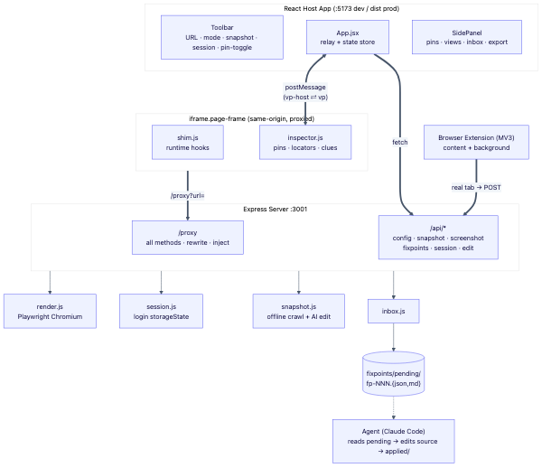
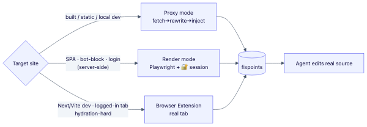

# VisualPrompt — Design Docs

A tool to pin AI-edit prompts onto a live web UI, collect them as **fixpoints**, drop them into a
server inbox as structured documents, and let an **agent edit the real source code**.

## Table of Contents

| Doc | Contents |
|---|---|
| [01-architecture.md](./01-architecture.md) | Overall architecture, components, data flow |
| [02-proxy-engine.md](./02-proxy-engine.md) | Proxy engine — URL rewriting, MIME, methods/cookies/Range, fallbacks |
| [03-collection-modes.md](./03-collection-modes.md) | Three collection paths (proxy / render / extension) + login session |
| [04-fixpoints-inbox.md](./04-fixpoints-inbox.md) | Fixpoint schema, agent handoff |
| [05-exception-handling.md](./05-exception-handling.md) | Full exception-handling & fallback inventory |
| [06-verification.md](./06-verification.md) | 1000-site stability verification — method & results |
| [07-limitations-decisions.md](./07-limitations-decisions.md) | Structural limits, design decision log |

## System at a glance

## Choosing a collection path

| Target | Recommended path |
|---|---|
| Built / static site, local dev server | **Proxy** (instant, interaction preserved) |
| SPA · bot-blocked · login required (server-side) | **Render (Playwright)** + 🔐 session |
| Next/Vite dev, hydration-hard sites, logged-in tab | **Browser extension** (real tab) |

See [07-limitations-decisions.md](./07-limitations-decisions.md) for the detailed criteria.
